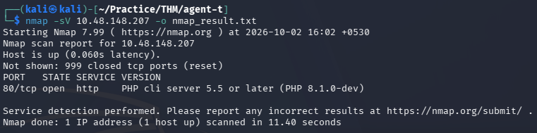
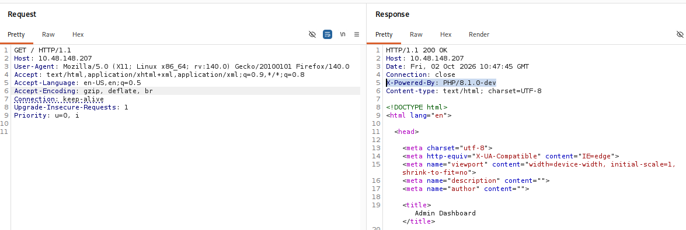
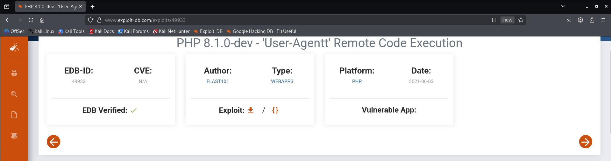
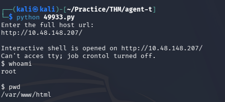
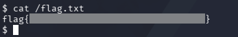

# Agent T — TryHackMe Writeup

| Room | Difficulty | Category | Target |
| :--- | :--- | :--- | :--- |
| [Agent T](https://tryhackme.com/room/agentt) | Easy | Web / RCE | `10.48.148.207` |

---

## 📖 Overview

The **Agent T** challenge on TryHackMe is an easy web security room. This room focus on recon, response header and RCE exploitation.

---

## 🛠️ Walkthrough

### 1. Reconnaissance

Run an Nmap service scan to discover open ports and services:

```bash
nmap -sV <TARGET_IP> -o nmap_result.txt
```

**Identified Ports:**
- **80/tcp**: Open (HTTP — `PHP cli server 5.5 or later (PHP 8.1.0-dev)`)



---

### 2. Web Enumeration & Header Inspection

Navigating to `http://<TARGET_IP>` in the browser loads an **Admin Dashboard** (user - admin)

Inspecting the HTTP response headers using Burp Suite confirms the server technology:

```http
X-Powered-By: PHP/8.1.0-dev
```
 
This matches the version detected earlier during the Nmap scan.

---

### 3. Vulnerability Research

Searching on **Exploit-DB** for `PHP 8.1.0-dev` reveals *PHP 8.1.0-dev - 'User-Agentt' Remote Code Execution*



---

### 4. Exploitation (Remote Code Execution)

Download and run the Python exploit script:

```bash
python 49933.py
```

Enter the target URL when prompted (`http://<TARGET_IP>/`). The script sends the crafted payload in the `User-Agentt` header and spawns an interactive root shell.



---

### 5. Finding the Flag

With root access confirmed, checks the root file system files `ls -la` shows the `/flag.txt` presents.

Then navigating to the root filesystem (`/`) reveals `flag.txt`:

```bash
cat /flag.txt
```



---

## 🚩 Flag

```text
flag{REDACTED}
```

---
