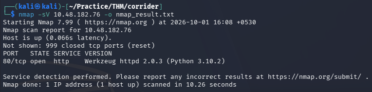
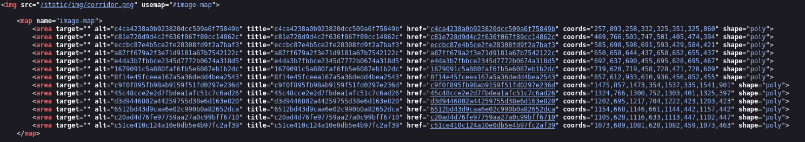
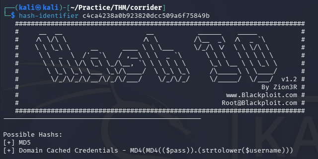
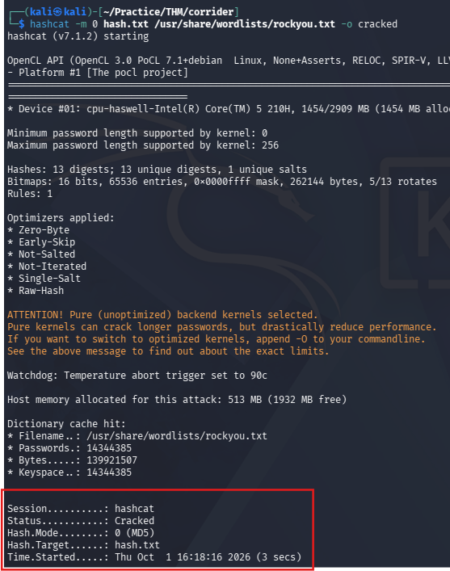
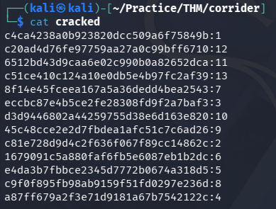
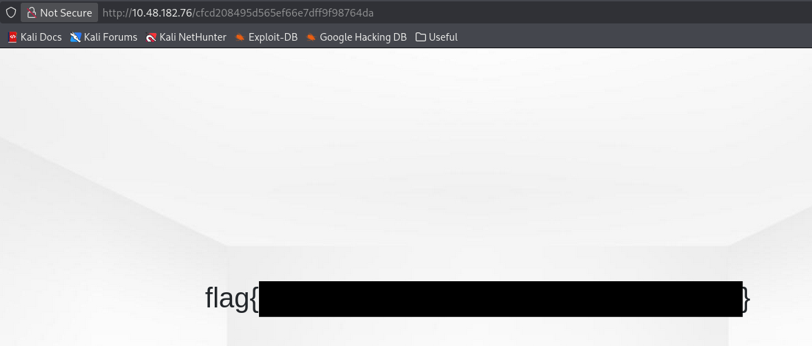

# Corridor — TryHackMe Writeup

| Room | Difficulty | Category | Target |
| :--- | :--- | :--- | :--- |
| [Corridor](https://tryhackme.com/room/corridor) | Easy | Web / IDOR | `10.48.182.76` |

---

## 📖 Overview

The **Corridor** challenge on TryHackMe is a beginner-friendly web security room focusing on Insecure Direct Object References (IDOR). By analyzing hashed endpoint URLs in an image map, identifying the underlying hashing algorithm (MD5), and cracking the values, we discover sequential numbering and manipulate the identifier to access an unauthorized room containing the flag.

---

## 🛠️ Walkthrough

### 1. Reconnaissance

Run an Nmap service scan to discover open ports and active services:

```bash
nmap -sV <TARGET_IP> -o nmap_result.txt
```

**Identified Ports:**
- **80/tcp**: Open (HTTP)



---

### 2. Web Enumeration

Access the web service at `http://<TARGET_IP>`.


Clicking on any door navigates to a blank page with a 32-character hexadecimal hash in the URL path (e.g., `http://<TARGET_IP>/c4ca4238a0b923820dcc509a6f75849b`).

Inspecting the page source reveals an image map containing links to 13 different doors, each represented by a distinct hash:



---

### 3. Hash Identification & Cracking

Analyze one of the hashes (`c4ca4238a0b923820dcc509a6f75849b`) using `hash-identifier`:

```bash
hash-identifier
```

The tool identifies the string as an **MD5** hash.



Save all 13 hashes into a file named `hash.txt` and crack them using Hashcat with the `rockyou.txt` wordlist:

```bash
hashcat -m 0 hash.txt /usr/share/wordlists/rockyou.txt -o cracked
```



Inspect the cracked results:

```bash
cat cracked
```

Each hash simply corresponds to sequential numbers from `1` to `13`:



---

### 4. Exploitation (IDOR)

Attempting to navigate directly to integer paths such as `http://<TARGET_IP>/1` returns a `404 Not Found`, confirming that the server only accepts MD5 hash representations.

Since the endpoints correspond to sequential room numbers `1` through `13`, we can test out-of-bounds room numbers to access unauthorized locations.

Testing the next room in sequence (`14`):

```bash
echo -n 14 | md5sum
# aab3238922bcc25a6f606eb525ffdc56
```

Navigating to `http://<TARGET_IP>/aab3238922bcc25a6f606eb525ffdc56` returns a 404 error.

Testing room `0`:

```bash
echo -n 0 | md5sum
# cfcd208495d565ef66e7dff9f98764da
```

Navigating to `http://<TARGET_IP>/cfcd208495d565ef66e7dff9f98764da` successfully accesses the hidden room and reveals the flag:



---

## 🚩 Flag

```text
flag{REDACTED}
```

---
