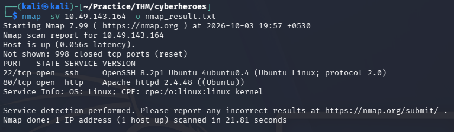
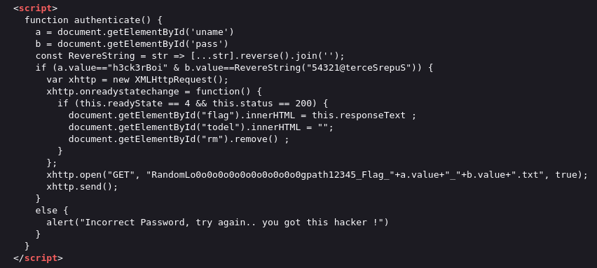
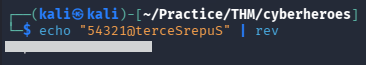
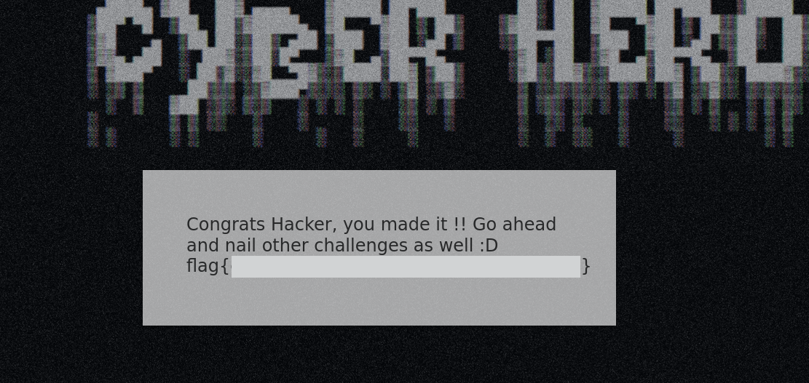

# CyberHeroes — TryHackMe Writeup

| Room | Difficulty | Category | Target |
| :--- | :--- | :--- | :--- |
| [CyberHeroes](https://tryhackme.com/room/cyberheroes) | Easy | Web / Client-Side Auth Bypass | `10.49.143.164` |

---

## 📖 Overview

The **CyberHeroes** challenge on TryHackMe is an easy web-based room. Hardcoded credentials verified by client-side JavaScript, reverse the password string, and log in to retrieve the flag.

---

## 🛠️ Walkthrough

### 1. Service & Port Scanning

Run an Nmap scan to check for open ports and services:

```bash
nmap -sV <TARGET_IP> -o nmap_result.txt
```

**Identified Ports:**
- **22/tcp**: Open (SSH)
- **80/tcp**: Open (HTTP)



---

### 2. Web Enumeration & Source Code Inspection

Open `http://<TARGET_IP>/` in the browser and navigate to the login page at `http://<TARGET_IP>/login.html`.

Inspect the page source. In the `<script>` tag, the authentication is handled directly on the client side:
- **Username:** Checked against the hardcoded string `h3ck3rBoi`.
- **Password:** Checked against the reverse of `54321@terceSrepuS` using a `RevereString()` function.



---

### 3. Password Recovery

The script checks for the reverse of `54321@terceSrepuS`. Reverse the string using the Linux `rev` command:

```bash
echo "54321@terceSrepuS" | rev
```

**Recovered Password:**
```text
[REDACTED]
```



---

### 4. Login & Flag Retrieval

Return to `http://<TARGET_IP>/login.html` and log in with the recovered credentials:
- **Username:** `h3ck3rBoi`
- **Password:** `SuperSecret@12345`

Once logged in, the client-side check passes and the flag is displayed on the page.



---

## 🚩 Flag

```text
flag{REDACTED}
```

---
