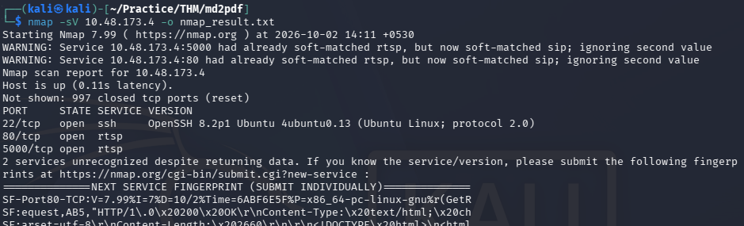
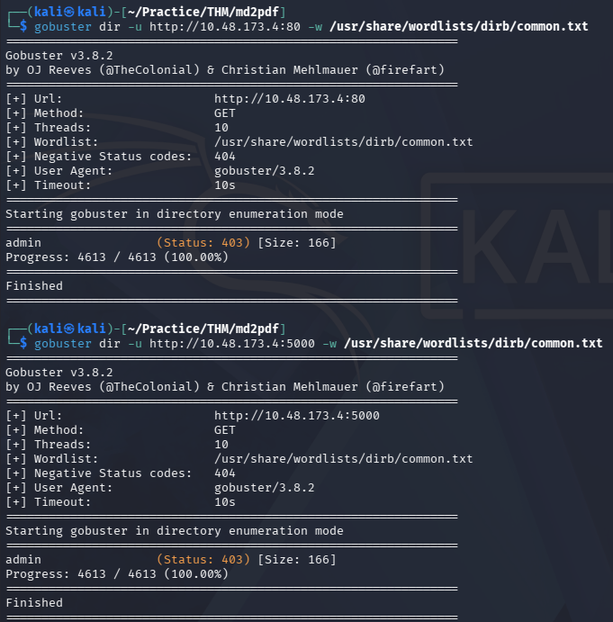
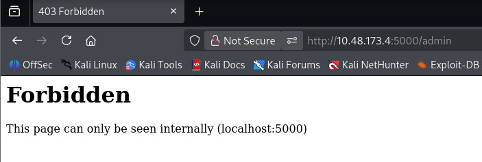
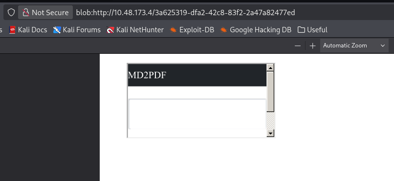
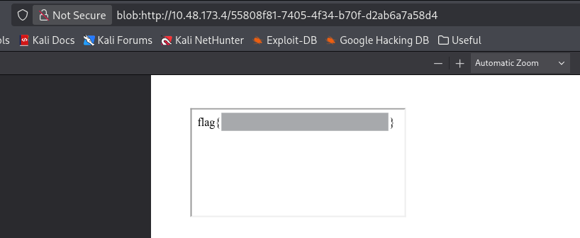

# MD2PDF — TryHackMe Writeup

| Room | Difficulty | Category | Target |
| :--- | :--- | :--- | :--- |
| [MD2PDF](https://tryhackme.com/room/md2pdf) | Easy | Web / SSRF | `10.48.173.4` |

---

## 📖 Overview

The **MD2PDF** challenge on TryHackMe is an easy web security room focusing on Server-Side Request Forgery (SSRF) via HTML injection in a Markdown-to-PDF conversion service. The application converts user-supplied Markdown and HTML into downloadable PDF documents.

---

## 🛠️ Walkthrough

### 1. Reconnaissance

Run an Nmap service scan to discover open ports and running services:

```bash
nmap -sV <TARGET_IP> -o nmap_result.txt
```

**Identified Ports:**
- **22/tcp**: Open (SSH)
- **80/tcp**: Open (HTTP — initially reported as RTSP by Nmap, confirmed as HTTP in browser)
- **5000/tcp**: Open (HTTP — initially reported as RTSP by Nmap, confirmed as HTTP in browser)



---

### 2. Web & Directory Enumeration

Visiting both ports `80` and `5000` in the browser reveals Markdown-to-PDF converter interfaces with an Text editor and a "Convert to PDF" button:
- **Port 80**: Tested with Markdown and HTML; conversion generates the rendered PDF successfully.
- **Port 5000**: Different interface, but the conversion does not function properly.

Run Gobuster on both ports to look for hidden directories:

```bash
# Scan port 80
gobuster dir -u http://<TARGET_IP>:80 -w /usr/share/wordlists/dirb/common.txt

# Scan port 5000
gobuster dir -u http://<TARGET_IP>:5000 -w /usr/share/wordlists/dirb/common.txt
```

Both scans identify an `/admin` directory with status code 403.



---

### 3. Analyzing the `/admin` Endpoint

Accessing `/admin` on both ports (`http://<TARGET_IP>/admin` and `http://<TARGET_IP>/admin`) returns a `403 Forbidden` error:

```text
Forbidden
This page can only be seen internally (localhost:5000)
```



The application restricts access to `/admin` based on the request origin, only allowing internal access from `localhost:5000`.

---

### 4. Exploitation (SSRF via iframe Injection)

Since the PDF conversion engine on port 80 executes on the server and renders raw HTML, we can test for Server-Side Request Forgery (SSRF) using an HTML `<iframe>`.

#### Step 1: Verify SSRF via iframe

First, test if the backend PDF renderer can fetch and display local internal services by embedding `http://localhost:5000`:

```html
<iframe src="http://localhost:5000"></iframe>
```

This will display the content of `http://localhost:5000`, confirming SSRF.



#### Step 2: Retrieve the Flag

Next, target the restricted `/admin` endpoint directly:

```html
<iframe src="http://localhost:5000/admin"></iframe>
```

This shows that the backend PDF generator fetches `http://localhost:5000/admin` locally from within the server, the internal access check passes and the flag is displayed in the generated PDF.



---

## 🚩 Flag

```text
flag{REDACTED}
```

---
