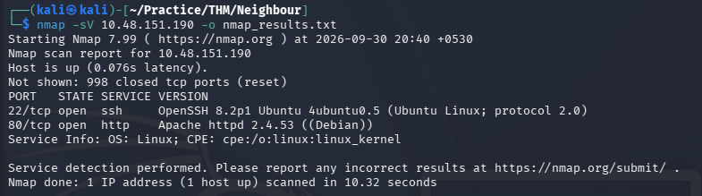
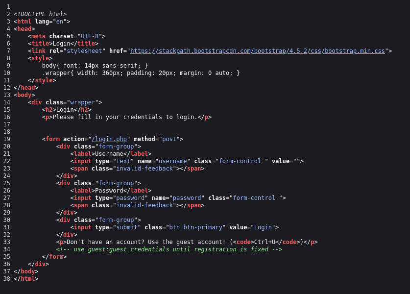
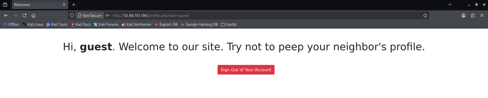
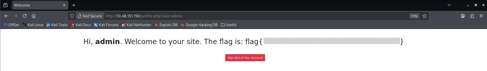

# Neighbour — TryHackMe Writeup

| Room | Difficulty | Category | Target |
| :--- | :--- | :--- | :--- |
| [Neighbour](https://tryhackme.com/room/neighbour) | Easy | Web / IDOR | `10.48.151.190` |

---

## 📖 Overview

The **Neighbour** challenge on TryHackMe is a beginner-friendly web security exercise focusing on basic authentication bypass and Insecure Direct Object Reference (IDOR) exploitation.

---

## 🛠️ Walkthrough

### 1. Reconnaissance

Run an Nmap service scan to discover open ports and running services:

```bash
nmap -sV <TARGET_IP> -o nmap_results.txt
```

**Identified Ports:**
- **22/tcp**: Open (SSH)
- **80/tcp**: Open (HTTP)



---

### 2. Initial Enumeration & Credential Discovery

Navigate to the HTTP service on `http://<TARGET_IP>`.

The login page presents a username and password field. The page source contains a comment revealing the guest account credentials:

```html
<!-- use guest:guest credentials until registration is fixed -->
guest:guest
```



---

### 3. Authentication Bypass via IDOR

Attempt to log in with the discovered credentials:

- **Username**: `guest`
- **Password**: `guest`

Successful login redirects to:

```text
http://<TARGET_IP>/profile.php?user=guest
```

This URL structure making it vulnerable to Insecure Direct Object Reference (IDOR).



Modify the `user` parameter to enumerate other accounts. Change the URL to access admin profile:

```text
http://<TARGET_IP>/profile.php?user=admin
```

---

### 4. Flag Retrieval

The IDOR vulnerability exposes the admin profile and the flag.



---

## 🚩 Flag

```text
flag{REDACTED}
```

---
