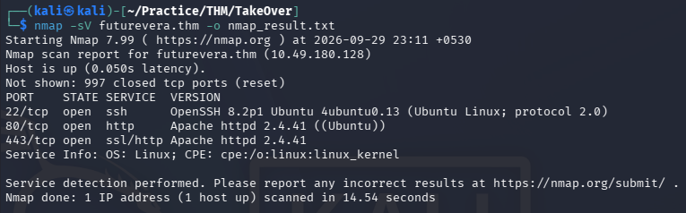
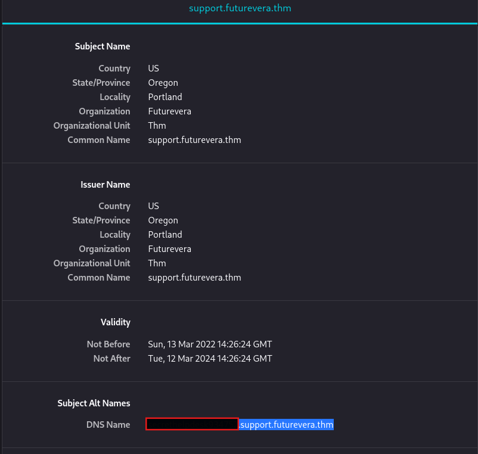
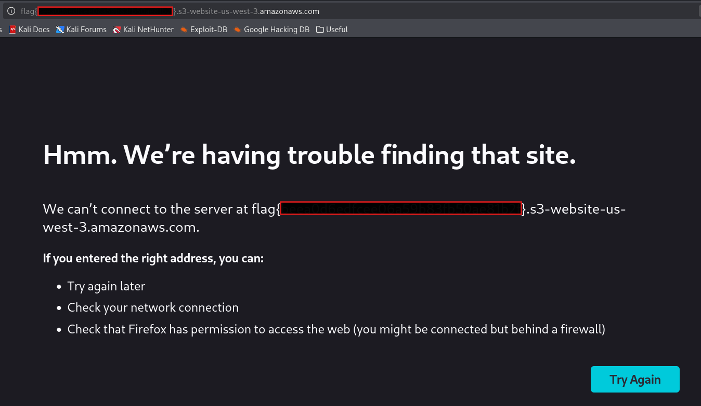

# TakeOver — TryHackMe Writeup

| Room | Difficulty | Category | Target |
| :--- | :--- | :--- | :--- |
| [TakeOver](https://tryhackme.com/room/takeover) | Easy | Web / Subdomain Takeover | `futurevera.thm` |

---

## 📖 Overview

The **TakeOver** challenge on TryHackMe focuses on subdomain enumeration, virtual host exploration, SSL/TLS certificate inspection, and identifying a subdomain takeover condition pointing to an AWS S3 bucket.

---

## 🛠️ Walkthrough

### 1. Host Configuration

The room description notes that the target website is hosted at `https://futurevera.thm`. A message from the CEO hints at potential subdomains based on the keywords `blog`, `help`, and `support`.

Add the target IP along with the domain and subdomains to `/etc/hosts`:

```bash
sudo nano /etc/hosts
```

```text
<TARGET_IP>    futurevera.thm blog.futurevera.thm help.futurevera.thm support.futurevera.thm
```

---

### 2. Service & Port Scanning

Run an Nmap service scan to discover active services and open ports:

```bash
nmap -sV futurevera.thm -o nmap_result.txt
```

**Identified Ports:**
- **22/tcp**: Open (SSH)
- **80/tcp**: Open (HTTP)
- **443/tcp**: Open (HTTP / SSL)



---

### 3. Web & Subdomain Enumeration

Explore the configured hosts via the browser over HTTPS:

- `https://futurevera.thm`: Main company homepage (no direct clues).
- `https://blog.futurevera.thm`: Dedicated blog page.
- `https://help.futurevera.thm`: Mirrors the main site content.
- `https://support.futurevera.thm`: Dedicated support portal.

None of the visible pages immediately contained flags or hidden comments.

---

### 4. SSL/TLS Certificate Inspection

Inspect the SSL/TLS certificate on `https://support.futurevera.thm` via the browser's certificate viewer.

Under **Subject Alt Name** / **DNS Name**, a hidden subdomain is exposed:

- **Discovered Subdomain:** `[REDACTED].support.futurevera.thm`



---

### 5. Subdomain Takeover & Flag Retrieval

Add the newly discovered subdomain to `/etc/hosts`:

```bash
sudo nano /etc/hosts
```

```text
<TARGET_IP>    [REDACTED].support.futurevera.thm
```

Navigate to `http://[REDACTED].support.futurevera.thm` over HTTP (port 80). The server redirects to an external AWS S3 bucket:

```text
http://flag{REDACTED}.s3-website-us-west-3.amazonaws.com
```

The redirected AWS URL and the S3 error response disclose the flag.



---

## 🚩 Flag

```text
flag{REDACTED}
```

---

